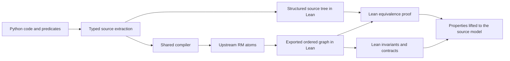

> Historical graph-pipeline evidence: retained for its recorded source and tool hashes. See formal/README.md for the current direct Lean pipeline.

# Reactive Modules examples: Python → compiled RM → Lean

**Peterson update:** the flattened example below records v1. Use the
[v2 comparison](peterson-v2.md) and [generated evidence](peterson-v2.html) for
separate native RM atoms, parallel composition, all initial flag valuations,
and Lean proofs of correspondence with the specified paper relation.

This report accompanies [the generated side-by-side comparison](fmsd99.html).
The implementation is in [examples/paper.py](../examples/paper.py); all four
examples use the existing `Specification` API and the same compiler. No
example supplies a handwritten Lean proof or a concrete `Trace`.
All four passed Lean's source-to-RM correspondence checks and the stated
property proofs. The HTML includes the accepted proof sources and axiom audits.

## Scope and relationship to the paper

Source: Rajeev Alur and Thomas A. Henzinger, *Reactive Modules*, Formal Methods
in System Design 15, 7–48 (1999), [Figures 1–2, printed pages 13 and 15](https://www.cis.upenn.edu/~alur/FMSD99.pdf).
Figure 1 supplies NOT, AND, and a latch whose output uses the previous state;
simultaneous set/reset permits either next state. Figure 2 supplies a
two-process mutual-exclusion protocol with independently sleeping processes;
both can update in one round, reading old values.

We implement these four examples as executable specializations. We do not
implement Figure 3's message-passing system or the later abstraction examples.
The general module composition, hiding, refinement, temporal abstraction, and
fairness machinery are outside this change.

The implementation's initialization restriction matters. The paper permits
input-dependent gate initialization and nondeterministic latch outputs and
protocol flags. Our constructors choose concrete values. Consequently, these
are not proofs of equivalence with every trace of the paper's modules. [Source](https://www.cis.upenn.edu/~alur/FMSD99.pdf)

## Reading the generated comparison

Open [fmsd99.html](fmsd99.html) in a browser. Each constructor, transition, and
property has three columns:

| Python | Compiled RM ordered graph | Generated Lean |
| --- | --- | --- |
| Actual function source, read with `inspect.getsource`. | Every input, wire equation, and output in the graph exported from actual upstream RM atoms. | Exact corresponding source-tree declaration, graph declaration, and translation theorem from `Translation.lean`. |

These columns are produced by [paper_report.py](../paper_report.py) after
verification succeeds. They are not manually edited translations. The complete
generated Lean files, proof logs, JSON graph artifact, source/tool hashes,
upstream revision, and final report are embedded beneath each example.
The HTML is self-contained and needs no JavaScript or network connection.

The middle column is a readable serialization of the exported RM representation,
**not an implementation of the paper's textual guarded-command language**.
`v0`, `v1`, etc. identify inputs and intermediate wires. `ite(c,a,b)` selects
`a` when `c` is true and `b` otherwise. `output[i]` identifies the next-state
field or method result. Inputs are labelled with their Python names, and the
generated state fields `f0`, `f1`, etc. are mapped to the class fields.

For methods, the compiler makes the old object state and call arguments inputs
to a transition module. It creates `zrth.Module`, `Term`, `Var`, and `Wire`
objects, then reads their ordered atoms back into the exported graph. Lean's
generated `model` connects each transition's next-state outputs to the following
round's state. Thus the per-method RM object is a transition component; the
generated state machine supplies the feedback and initial state. It is not
a persistent upstream module being run by PyTorch during the proof.

The Python constructor is compiled separately using the RM initialization
action. Transition graphs are taken from update actions. The compiler's dummy
initial values for standalone transition outputs are not the object's verified
constructor state.

## What each example establishes

The equations below are reading aids for the implementation. The HTML contains
the complete, unsimplified generated graph and exact Lean source.

| Example | Executable interface and chosen initialization | Effect of a round | Meaningful Lean property |
| --- | --- | --- | --- |
| NOT | `NotGate()`: `out=True`; `tick(signal)` | `out_next = not signal` | Every call produces the Boolean negation, for either input. |
| AND | `AndGate()`: `out=False`; `tick(left,right)` | `out_next = left and right` | Every call produces conjunction, for all input pairs. |
| Latch | `Latch()`: `out=state=False`; `tick(set_,reset,choose_set)` | Output becomes old state; the control inputs determine the next state. | Output has a one-round delay; hold, set, and reset obey the relational contract. |
| Peterson | `Peterson()`: both program counters zero and flags false; `tick(run1,run2)` | Both processes decide from the same old-state snapshot. | Both processes can never occupy the critical section together. |

### NOT and AND

The initial NOT output corresponds to an initial low input. The initial AND
output corresponds, for example, to two initial low inputs. Those inputs are
not stored as fields: each `tick` argument represents the new environment input
for that round. The contract is quantified over every call argument, with no
precondition.

The specifications request contracts only. Their generated `safe` predicate
is the empty conjunction, `True`; its induction theorem is not evidence of
gate correctness. The relevant theorems are `contract` and `source_contract`
in `Contract0.lean`, together with the translation theorems for code and
contract predicates.

### Set/reset latch

The assignment to `out` precedes the assignment to `state`, so it reads the
latched state. With both controls false, the state holds. With set alone it
becomes true; with reset alone it becomes false. With both asserted it takes
the unconstrained Boolean argument `choose_set`.

This is nondeterminism exposed as an environment choice, not a random sample.
The proof quantifies over both choices on every round. The relational contract
intentionally does not demand a particular state in the both-high case. The
translation theorem separately establishes that the implementation follows
its supplied selector. The finite relation check verifies that ranging over
the selector produces exactly both permitted outcomes, with neither missing.

For example, from `state=False`, a set-only tick produces `out=False` and
`state=True`. The following tick exposes `out=True`. Updating `state` before
copying it into `out` would break the proved contract.

The constructor fixes a low initial output and state. We do not claim that
this constructor models every permitted initialization. Update correctness
is checked separately over all Boolean input combinations.

### Two-process mutual exclusion

Program counters are represented by integers: `0` means outside, `1` requesting,
and `2` inside. The ordinary Python implementation copies `pc1`, `pc2`, `x1`,
and `x2` into locals before changing any field. The two independent Boolean
arguments select whether each process attempts its enabled update. They allow
four schedules, including both sleeping and both moving.

This encoding makes one method call a complete logical round. It does not
implement operating-system threads or assume atomicity of a real distributed
read/write sequence. It also does not prove that a waiting process eventually
enters: a process can be left asleep forever by the environment.

The requested invariant is:

```python
not (state.pc1 == 2 and state.pc2 == 2)
```

The specification supplies two strengthening predicates:

1. Both counters are in the range 0 through 2.
2. If process 1 is inside and process 2 is requesting, their flags differ;
   if process 2 is inside and process 1 is requesting, their flags agree.

These are **proved together**, not assumed. The generated proof checks their
joint initialization and preservation under every `run1,run2` choice. Without
the relational strengthening, arbitrary safe-looking states can have flags
that let the waiting process enter while the other remains inside. Such states
must be excluded by an established invariant, not by deleting simultaneous
updates from the scheduler.

## Proof pipeline and trust boundary

The actual pipeline has two branches, because proving compiler correspondence
requires something independent of the compiler output:



For each function, `translationN` equates structured-statement execution with
ordered-graph execution for all appropriately typed inputs. `source_model_eq`
connects initial states and all selected transitions. Predicate agreement
theorems connect the original property representation to its compiled graph.

The shared generator also emits `graph_evalN`: a normalization of the exported
wire graph checked by Lean's `rfl`. The readable graph column still shows the
original wires. Source sequencing is reduced before arithmetic expressions,
and case splitting retains useful splits even if simplification makes no
additional change. These changes make the larger example tractable without
adding an example-specific compiler, changing its Python transition, or assuming
the normalization correct. A regression test corrupts normalization and checks
that Lean rejects it.

Shared, proved Boolean-encoding laws avoid expanding a conditional for every
Boolean operation. Arithmetic closes branches where possible; Lean's `grind`
handles remaining logical obligations. These are proof-producing tactics,
subject to the same kernel checks and axiom audit as every other obligation.

The Peterson `invariant` theorem uses initialization plus one-step preservation
to establish safety in every reachable state. `always_safe` quantifies over
every index of every infinite execution, and `source_invariant` lifts the result
to structured source execution. Contracts quantify over reachable pre-states
and arbitrary method inputs; `source_contract` lifts them to the source model.

No finite exploration depth establishes a positive result. The verifier uses
Lean reduction, case analysis, and arithmetic proof tactics, and requires
successful axiom audits. The accepted axiom set is limited to `propext`,
`Classical.choice`, and `Quot.sound`. A failed theorem, missing audit, `sorryAx`,
or timeout cannot yield `proved`. Read the embedded logs to see each theorem's
actual dependencies.

What remains trusted is the frontend's extraction and binding of Python source,
the specified execution boundary, and our interpretation of the supported
Python and RM operations. The Lean source interpreter and graph interpreter
share the primitive expression semantics. The checks therefore do not prove
CPython correct, nor establish independently that the chosen interpretation is
the paper's complete RM semantics. Native Rust/PyTorch execution is not covered.
The finite Python/RM comparisons exercise this boundary but do not close it.

Within those assumptions, a wrong exported graph that changes observable
behavior must fail correspondence; proving the wrong graph safe is insufficient.
Conversely, errors shared by extraction or the primitive semantics remain a
reason to review those small shared components.

## Validation and reproduction

From the repository root, with Git, uv, the native build toolchain, and elan
available:

```sh
# First-time setup
git submodule update --init --recursive
python3 formal/bootstrap.py

# Existing verifier acceptance tests
formal/.venv/bin/python formal/test_rmverify.py -v

# Finite relation checks and all four Lean proof runs
formal/.venv/bin/python formal/test_paper.py -v

# Regenerate this comparison's HTML and fresh Lean evidence
formal/.venv/bin/python formal/paper_report.py

# Or verify one example directly
formal/.venv/bin/python -m rmverify examples.paper:peterson --timeout 120
```

[test_paper.py](../test_paper.py) uses an independently written, set-valued
one-round relation. It compares the set of outcomes from all selector choices
with that relation, and also compares Python outputs with the compiled RM
graph. It checks 4 NOT cases, 8 AND cases, 32 latch cases, and 144 protocol cases:
**188 exhaustive finite round checks**, including unreachable protocol states
with valid control locations. It additionally explores protocol reachability
from the chosen constructor and checks the strengthening predicates. These
finite checks are regression evidence, distinct from the unbounded Lean proofs.

The proof test asserts that every specification has `checks=[]`, every report
succeeds, and the source correspondence and relevant source property audits
exist. The report generator reruns the finite checks and the actual verifier;
it refuses to replace the HTML if any proof fails. The generated result table
and complete logs record the observed outcomes, rather than inferring success
from the existence of generated `.lean` files.

The generator prints each evidence directory. Inside a fresh directory, the
compiled imports already exist, so individual proof files can be checked with:

```sh
lake env lean Translation.lean
lake env lean Invariants.lean
# Gates and latch also have this contract file:
lake env lean Contract0.lean
```

To rebuild imports after removing local Lean build products:

```sh
lake build Semantics
lake env lean Translation.lean -o .lake/build/lib/lean/Translation.olean
lake env lean Invariants.lean -o .lake/build/lib/lean/Invariants.olean
# Where present:
lake env lean Contract0.lean
```

The HTML embeds the evidence as a snapshot. Absolute evidence/source paths in
its JSON describe the generating checkout; they are not portable links and
do not establish freshness after edits. Regeneration creates new evidence and
hashes. The pinned upstream revision and Lean toolchain are recorded alongside
the proofs.

The paper test and report commands allow 120 seconds per Lean obligation; this
is a resource limit, not an execution bound. A slower machine can use, for
example, `formal/paper_report.py --timeout 300` with the installed Python.

## What these examples add

The gates exercise Boolean translation and universal functional contracts. The
latch tests old-state versus next-state ordering and an explicit choice input.
The protocol tests independent same-round updates, multiple state fields,
integer control locations, and strengthening for an unbounded safety argument.
All use one compiler and proof generator. Their successful verification still
does not extend the supported language to async Paxos or supply the paper's
general compositional verification theory.
