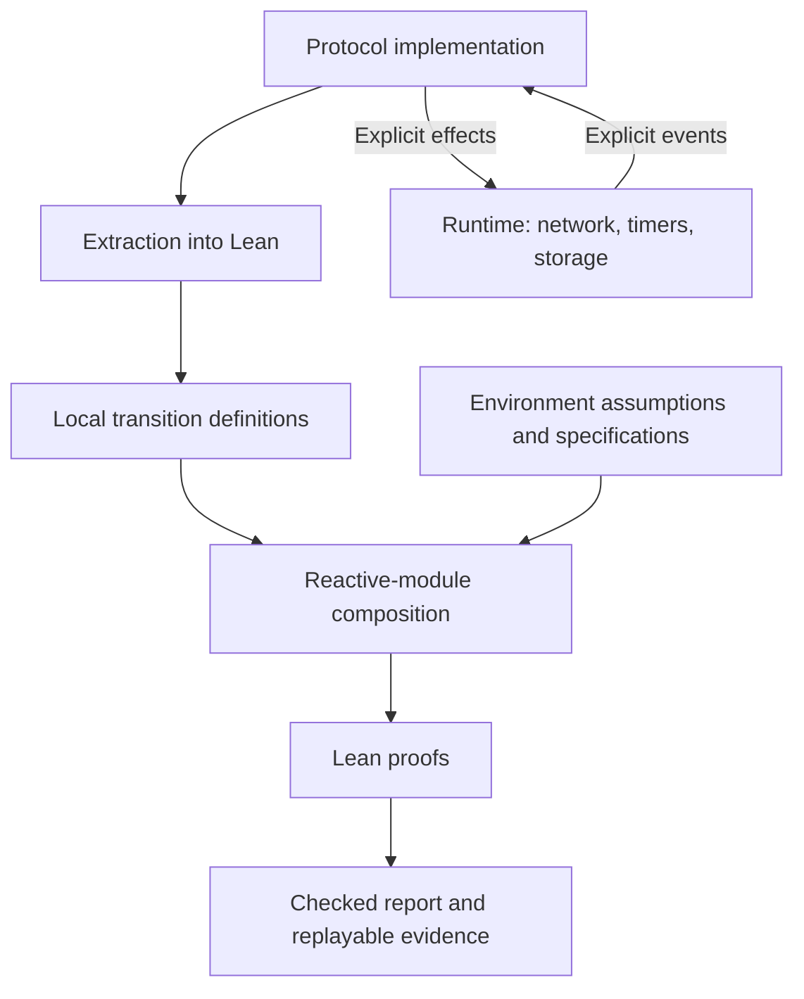

# Minimum usable formal verification pipeline

Recorded: 2026-09-17.

This is a design reference requested by the user, not a claim that all proposed
capabilities are implemented. Preserve this direction when planning future work.
The original request was to save the design. A subsequent request explicitly
authorized the Rust pipeline implementation; see the implementation update below.

## Implementation update

The subsequent Rust implementation is documented in [Rust → Lean
verification](../rust/README.md). It uses Hax/Charon/Aeneas, extends the shared
reactive-module library with executions and fairness, and checks safety and
conditional liveness for the supplied three-acceptor Paxos protocol library.
The existing Python frontend is retained. The original evaluation-first roadmap
below is historical context; the Rust evaluation and implementation are now done.
The broader property catalogue and deployed transport/crash-recovery proofs are
not implemented by this milestone.

## Objective and foundation

Make it practical to connect executable protocol implementations to Lean-checked
properties using reactive modules as the common compositional system model.

The eventual property catalogue includes safety, liveness, consistency,
Byzantine resistance, availability, authentication, non-repudiation,
accountability, fairness, censorship resistance, equivocation resistance, fork
consistency, linearizability, serializability, atomicity, idempotence, replay
resistance, freshness, monotonicity, finality, resource and time bounds, time
complexity, incentive compatibility, individual rationality, collusion
resistance, confidentiality, and deniability.

Reactive modules describe execution and composition. Lean supplies the general
property and proof language. Strategies, observations, probability, utilities,
and relations between executions extend the semantics when needed. The aim is
to accommodate every property class, not to automatically decide every claim.

## Architectural decision

Use a small executable protocol core, one extraction path into Lean, and one
reactive-module library. Keep the existing restricted Python frontend for the
first usable workflow. Evaluate Rust → Charon → Aeneas → Lean for a
production-oriented replacement using a representative example before deciding
to migrate. Do not maintain two frontends initially.



## 1. Verified unit: sequential event handler

Each component owns its state. Its conceptual interface is:

```text
step(state, event) → updated state, emitted effects
```

Events include message receipt, timer firing, and storage completion. Effects
include sending messages, scheduling timers, and requesting persistence.

- Other components cannot mutate the component's state.
- Messages crossing the boundary have value semantics.
- Network access, clocks, randomness, and storage use explicit interfaces.
- The runtime serializes handlers for each component.
- Internal mutation is allowed when its ownership and effects are accounted for.

Requesting a write is not equivalent to completing a durable write. Model
completion and recovery when a property depends on persistence. Neither Python
nor Rust automatically makes a whole handler atomic with respect to crashes.

Python requires a restricted subset and an enforced calling boundary. Rust's
ownership discipline helps enforce that boundary, but does not prove protocol
correctness or that the deployed runtime implements the modeled transitions.

## 2. One implementation-to-Lean bridge

The bridge produces transition definitions and states why they describe the
implementation.

Reuse the existing Python pipeline's source validation, extraction, Lean source
interpreter, generated-function correspondence, explicit faults, and ownership
checks. Its documented trust boundary still applies: source/name/type/effect
extraction and the interpretation of the supported fragment are trusted; the
CPython heap and arbitrary outside mutation are not formalized.

Lean checks permission certificates over extracted accesses and loans. That
does not independently prove that extraction captures every effect of the
original Python program. The necessary condition is sound correspondence
between actual mutations and modeled state changes. Ownership restrictions are
one way to establish this; explicit heap reasoning or immutable values are
alternatives.

For Rust, evaluate existing Charon/Aeneas extraction rather than writing a new
translator. Check actual collections, borrowing patterns, dependencies, and
tool-version compatibility on a small example. Extraction tooling is not
automatically a fully verified compiler. Record its trust assumptions. Local
Rust-to-Lean extraction does not supply distributed-system composition or
runtime-refinement proofs.

Reference: https://github.com/AeneasVerif/aeneas

## 3. One semantic library in Lean

Reuse `formal/rmverify/lean/Semantics.lean`. Maintain stable definitions for:

| Definition | Purpose |
| --- | --- |
| Initial states and transitions | Describe each component |
| Composition and environment | Describe permitted system behavior |
| Reachability and executions | Connect local steps to whole-system behavior |
| Observations and event histories | Describe externally visible behavior |
| Refinement | Connect concrete implementations to simpler specifications |

Where it reduces maintenance, prove protocol properties over a stable abstract
specification and prove that the extracted implementation refines it. For small
examples, direct proofs over extracted transitions suffice.

Add strategy, probability, utility, temporal, and relational definitions in this
same library as concrete examples require them. Preserve who controls each
choice and what each agent can observe; flattening these distinctions into
undifferentiated nondeterminism is insufficient for strategic reasoning.

## 4. Small specification interface with handwritten Lean proofs

Retain the convenience API in `formal/rmverify/api.py`: transitions, contracts,
invariants, composition, and strengthening. Provide a supported path for
handwritten Lean lemmas and proofs.

The developer workflow must allow:

1. Write implementation and property.
2. Run verification.
3. Obtain automatic proofs for straightforward obligations.
4. Add a lemma or invariant when automation stops.
5. Regenerate and rerun without losing handwritten work.

Keep generated definitions and handwritten proofs in separate files. An
`unknown` result must not be a dead end that can only be resolved by modifying
the verifier itself.

A temporal-logic parser, graphical model editor, and new specification language
are not necessary for the first version.

## 5. One command with actionable diagnostics

One command validates, extracts, proves, and produces a readable report.

| Result | Meaning |
| --- | --- |
| Proved | Lean accepted the stated claim under displayed assumptions |
| Refuted | A checked execution violates the claim |
| Unknown | The obligation remains unproved |
| Unsupported | The implementation exceeds the accepted language subset |
| Error | The pipeline failed |

For unknown results, show remaining obligations with source-level names. For
refutations, show the event sequence and relevant state changes. Solver models
alone must not authorize a refutation; retain checked replay.

Display the guarantee's scope: crash model, delivery assumptions, arithmetic
semantics, and external functions. Distinguish model correctness from
implementation correspondence. Do not present either as proof of the deployed
runtime without the corresponding connection.

Reuse the current reporting and counterexample machinery.

## 6. Independent replay as the CI contract

Artifacts contain exact sources, specifications, assumptions, generated
definitions, proofs, and pinned tool versions. CI regenerates from current
sources and checks all required claims. Independent recipients can replay an
artifact.

Reuse `formal/rmverify/recheck.py` and the existing evidence machinery. Replaying
an old artifact does not by itself establish a claim about changed source code.

## Minimum tool stack

| Purpose | Tool |
| --- | --- |
| Implementation checking and extraction | Existing restricted Python frontend, or Rust + Charon/Aeneas after evaluation |
| Semantics, specifications, proof checking | Lean + Lake |
| Proof assistance | Lean tactics; existing SMT integration where useful |
| Developer workflow | Existing editor support, one CLI, ordinary CI |
| Evidence | Files and a standalone replay command |

Prioritize a disciplined runtime boundary, a supported manual-proof workflow,
and clear source-level diagnostics. Another verification engine is not the
primary missing piece.

## First usability milestone

A developer can:

1. Modify the commitment-device implementation.
2. Obtain a checked mismatch-detection proof.
3. Introduce a duplicate-processing bug and receive a readable, checked
   counterexample.
4. Repair the bug.
5. Have a fresh CI environment replay the result.

The target accepts at most one symbol per agent/session and emits an authentic
receipt; escrow compares the actual accepted symbol with an immutable promise.
Distinguish detection after checking evidence from eventual checking, which
requires evidence availability and progress assumptions.

For a later incentive proof, remember the counterexample from the discussion:
penalizing a mismatch encourages keeping a promise, but an agent can promise
Defect and then defect without penalty. Cooperation after an irrevocable
cooperation commitment, voluntary participation, and resistance to abort or
withholding deviations are separate obligations.

Complete the usability milestone before expanding the language subset or
building tooling for the full property catalogue.

## Related implementation references

- `formal/README.md`: supported workflow and proof boundaries.
- `formal/reports/full-pipeline.md`: detailed architecture and trust boundary.
- `formal/rmverify/frontend.py`: source extraction and ownership restrictions.
- `formal/rmverify/lean/Borrowing.lean`: extracted permission certificates.
- `formal/rmverify/lean/Semantics.lean`: reactive-module semantics.
- `formal/rmverify/api.py`: current specification interface.
- `formal/rmverify/recheck.py`: independent evidence replay.
- `formal/examples/delivery_spec.py`: explicit network behavior and replay
  resistance example.
